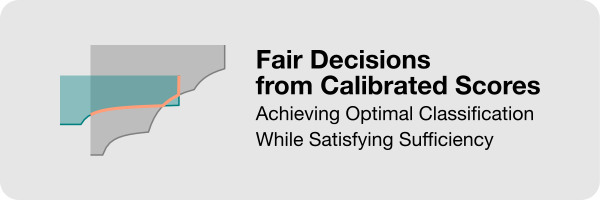

<br>
<p align="center">
  
</p>

# Fair decisions from calibrated scores

This repository contains code for reproducing the experiments in

**Fair decisions from calibrated scores: Achieving optimal classification while satisfying sufficiency**<br>
Etam Benger and Katrina Ligett. To appear in the International Conference on Machine Learning (ICML 2026).

Paper: [arXiv:2602.07285](https://arxiv.org/abs/2602.07285)

The paper gives an exact solution for optimal binary randomized classification under sufficiency, i.e., predictive parity: equality of PPV and FOR across groups. Given group-calibrated scores and group membership, the main algorithm post-processes the scores to obtain a loss-optimal classifier satisfying sufficiency. The notebooks reproduce the synthetic, FICO, COMPAS, and ACS Income experiments from the paper.

## Contents

The folder `experiments/` contains the following files:

| File | Description |
| --- | --- |
| `boundary_trace.py` | Boundary-tracing implementation, including **Algorithm 1: Boundary Trace**, and the auxiliary endpoint computation used by the algorithm. |
| `plotting.py` | Plotting helpers used by the notebooks. |
| `synthetic.ipynb` | Synthetic examples illustrating the feasible regions and the intersection-boundary algorithm, together with the synthetic calibration-error experiment. |
| `fico.ipynb` | FICO experiment using the aggregated FairMLBook credit-score data. Reproduces the FICO sufficient classifier and the corresponding feasible-region figure. |
| `compas.ipynb` | COMPAS experiment using the ProPublica two-year recidivism data. Reproduces the COMPAS sufficient classifier and feasible-region figure. |
| `acsincome.ipynb` | End-to-end ACS Income experiment, starting from raw feature data rather than precomputed scores. Includes model training, group calibration, post-processing, the main ACS comparison, and the calibration-subsampling experiment. |

## Running the notebooks

The notebooks in `experiments/` can be run independently of one another, using the shared `boundary_trace.py` and `plotting.py` modules in the same folder. They are saved with outputs, so the reported values and figures can be viewed without rerunning the experiments. These outputs were generated in Google Colab using the dependencies listed in `requirements.txt`.

To install the required Python packages:

```bash
pip install -r requirements.txt
```

The ACS Income notebook is substantially more expensive than the others: the paper version uses 100 train/test splits and repeated calibration subsampling. For a quick test run, reduce `n_reps` and `n_cal_reps` in the notebook.

## Data sources

The notebooks download or load all datasets directly:

| Notebook | Source |
| --- | --- |
| `fico.ipynb` | Aggregated FICO credit-score data from Barocas, Hardt, and Narayanan, *Fairness and Machine Learning: Limitations and Opportunities* (MIT Press, 2023), available through the [FairMLBook credit-score data repository](https://github.com/fairmlbook/fairmlbook.github.io/tree/master/code/creditscore/data). |
| `compas.ipynb` | COMPAS two-year recidivism data from Angwin, Larson, Mattu, and Kirchner, "Machine Bias" (ProPublica, 2016), available through ProPublica's [compas-analysis repository](https://github.com/propublica/compas-analysis). |
| `acsincome.ipynb` | ACS Income data from Ding, Hardt, Miller, and Schmidt, "Retiring Adult: New Datasets for Fair Machine Learning" (NeurIPS, 2021), loaded here from [OpenML dataset 43141](https://www.openml.org/d/43141). |
| `synthetic.ipynb` | Synthetic distributions specified directly in the notebook. |

## Citation

```bibtex
@article{benger2026fair,
  title = {Fair decisions from calibrated scores: Achieving optimal classification while satisfying sufficiency},
  author = {Benger, Etam and Ligett, Katrina},
  journal = {arXiv preprint arXiv:2602.07285},
  year = {2026}
}
```
